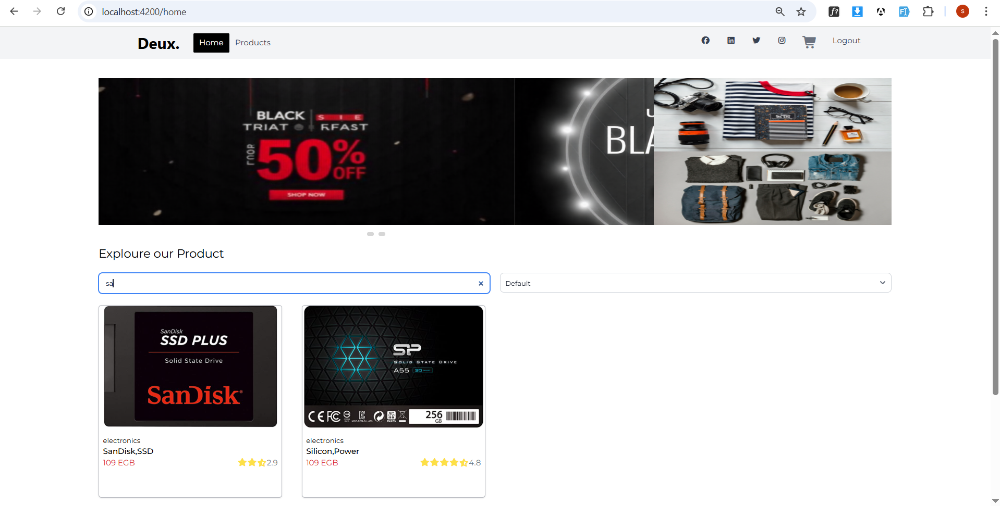
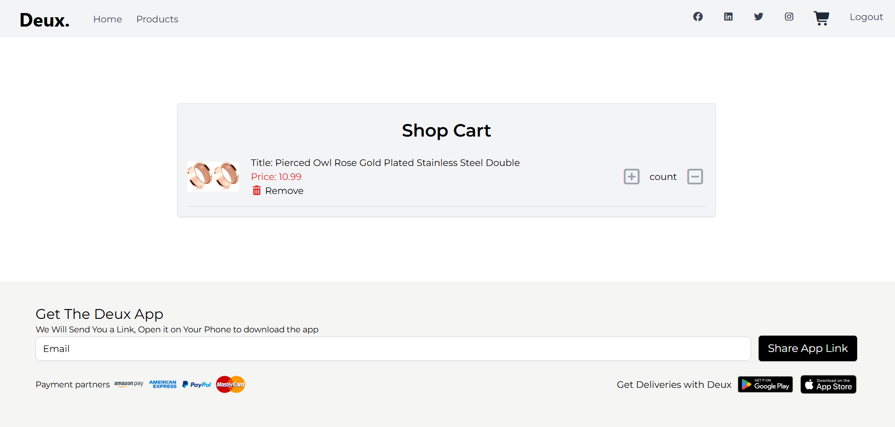
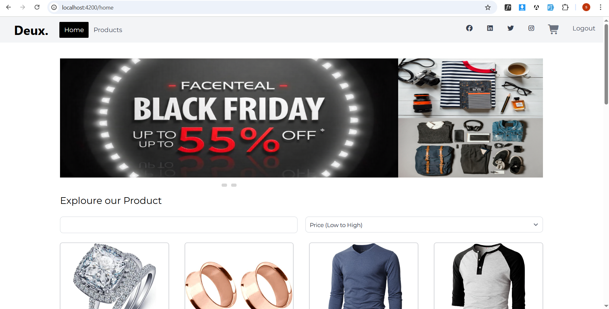

# 📸 Product Gallery Web Application (Deux) - Clean Architecture

A robust and intuitive product gallery web application built with Angular 19, leveraging Clean Architecture. It uses NgRx for state management, local storage for caching, and integrates with a mock API for product data. Supports both dark/light themes and responsive design across devices.

---

## ✨ Features

- *📦 Product Grid*: Displays products in a responsive grid with hover effects, ratings, and pricing.
- *🛒 Shop Cart*: Manage selected products with quantity adjustments and removal options.
- *🔍 Search & Filtering*: Explore products by name or sort by price.
- *🎉 Promotional Banners*: Highlight sales and special offers.
- *📴 Offline Support*: View cached products using local storage.
- *🏗️ Clean Architecture*: Scalable, testable, and maintainable codebase.
- *🧠 NgRx State Management*: Predictable and efficient state handling.
- *💾 Local Storage*: Persistent caching of product data.
- *🧩 Dependency Injection*: Managed via Angular's built-in DI.
- *🌐 Connectivity Awareness*: Real-time network status indicator (optional).
- *🍷 Dark/Light Theme*: Seamless theming with persistent state.
- *📱 Responsive UI*: Fluid layout optimized for all device sizes.

---

## 📁 Folder Structure
src/
├── core/
│   ├── api/            # API config, HttpClient setup, constants
│   ├── di/             # Angular DI setup
│   ├── errors/         # Error handling (e.g., ServerFailure, CacheFailure)
│   └── network/        # Network connectivity checker
│
└── features/
└── product-gallery/
├── data/
│   ├── model/            # Data models for API and storage
│   ├── data-source/
│   │   ├── remote/       # HttpClient service
│   │   └── local/        # Local storage service
│   └── repository/       # Repository implementation
│
├── domain/
│   ├── entity/           # Core business entities
│   ├── repository/       # Abstract repository contract
│   └── use-case/         # Business logic
│
└── presentation/
├── store/            # NgRx state management
├── components/       # UI components
└── pages/            # Main application pages

text

---

## 🛠️ Tech Stack & Packages

| Functionality         | Package/Technology           | Description                       |
|-----------------------|------------------------------|-----------------------------------|
| State Management      | @ngrx/store, @ngrx/effects | NgRx-based architecture          |
| Dependency Injection  | Angular DI                   | Built-in Angular DI system        |
| API & Serialization   | @angular/common/http       | HTTP client + JSON handling       |
| Data Caching          | localStorage               | Browser-based persistent storage  |
| Image Caching         | ngx-cache (optional)       | Efficient image caching           |
| Connectivity Check    | angular-connection-service | Monitor internet connection       |
| Theme Persistence     | localStorage               | Save user-selected theme          |
| HTTP Client           | @angular/common/http       | Networking backend                |
| Utilities             | rxjs                       | Reactive programming utilities    |
| Styling               | Tailwind CSS 4               | Utility-first CSS framework       |

---

## ✨ Dependencies

json
{
  "dependencies": {
    "@angular/animations": "~19.0.0",
    "@angular/common": "~19.0.0",
    "@angular/compiler": "~19.0.0",
    "@angular/core": "~19.0.0",
    "@angular/platform-browser": "~19.0.0",
    "@angular/platform-browser-dynamic": "~19.0.0",
    "@angular/router": "~19.0.0",
    "@ngrx/store": "^16.0.0",
    "@ngrx/effects": "^16.0.0",
    "rxjs": "~7.8.0",
    "tailwindcss": "^4.0.0",
    "ngx-cache": "^5.0.0",
    "angular-connection-service": "^1.0.0",
    "zone.js": "~0.14.0"
  }
}
✨ Dev Dependencies
json

{
  "devDependencies": {
    "@angular-devkit/build-angular": "~19.0.0",
    "@angular/cli": "~19.0.0",
    "@angular/compiler-cli": "~19.0.0",
    "typescript": "~5.4.0",
    "tailwindcss": "^4.0.0",
    "postcss": "^8.4.0",
    "autoprefixer": "^10.4.0"
  }
}
📸 Screenshots

Description	Light Mode	Dark Mode
💠 Shop Cart		—
🔄 Product Grid		—
🎉 Promotional Banner		—
Note: Screenshots are placeholders. Replace with actual images from your project stored in the screenshots/ folder. Dark mode screenshots can be added if implemented.

🚀 Getting Started
✅ Prerequisites
Node.js: Version 18.x or later
npm: Version 8.x or later
Angular CLI: Version 19.x (npm install -g @angular/cli@19)
📦 Setup Instructions
bash

# Clone the repo
git clone https://github.com/your-username/product-gallery-angular.git
cd product-gallery-angular

# Install dependencies
npm install

# Install Tailwind CSS
npm install tailwindcss @tailwindcss/postcss postcss --save-dev

# Configure Tailwind CSS
npx tailwindcss init -p

# Update tailwind.config.js
module.exports = {
  content: ["./src/**/*.{html,ts}"],
  theme: { extend: {} },
  plugins: [],
}

# Update src/styles.css
@import "tailwindcss";

# Run the development server
ng serve --open
⚙️ Configuration
🔑 Mock API Setup
Create a mock API endpoint or use a service like JSONPlaceholder.
Open src/core/api/api-config.ts and update the base URL:
typescript

export const API_CONFIG = {
  baseUrl: "https://fakestoreapi.com/",
};
🔒 Offline Support
📴 Offline Mode: Automatically loads products from localStorage if no internet.
🌐 Online Mode: Fetches fresh data and caches it locally.
🖼️ Cached Images: Seamless viewing of previously loaded product images.
🤝 Contributing
Fork this repo
Create your feature branch: git checkout -b feature/YourFeature
Commit your changes: git commit -m 'Add feature'
Push to the branch: git push origin feature/YourFeature
Open a Pull Request
📄 License
This project is licensed under the MIT License.

See the LICENSE file for details.

🙏 Acknowledgments
Built with Angular 19 and Tailwind CSS 4.
Inspired by modern e-commerce and portfolio gallery designs.
text
